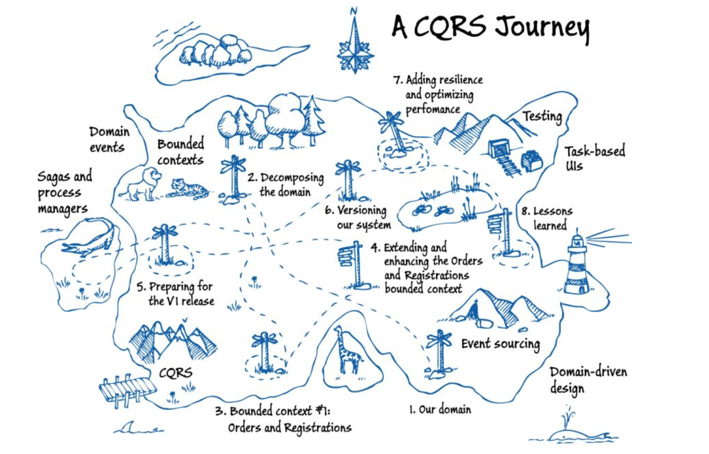

# cqrs-path
Repo with a simple markdown file containg all content that I consumed during my CQRS learning path. The order of the links is in, what I consider, the best way for learning from scratch all the concepts, gains and drawbacks before actually start to code.

## General stuff

- Pattern: Command Query Responsibility Segregation (CQRS), by Chris Richardson: https://microservices.io/patterns/data/cqrs.html
- CQRS Documents, by Greg Young: https://cqrs.files.wordpress.com/2010/11/cqrs_documents.pdf
- How CQRS works with Spring tools, by Jakub Pilimon:  https://thenewstack.io/how-cqrs-works-with-spring-tools/
- Implementing CQRS with .Net Core (PT-BR): https://www.youtube.com/watch?v=AQcsfIXQj18&list=PLiLEprTIvTvazGZr-FCXdRUNmMZ0GoHk0&index=2&t=0s
- CQRS Theory and Practice (PT-BR): https://www.youtube.com/watch?v=lBr1DCfM90U&list=PLiLEprTIvTvazGZr-FCXdRUNmMZ0GoHk0&index=3&t=0s
- Exploring CQRS and Event Sourcing (Microsoft patterns & practices): https://www.amazon.com/dp/B00EUGIRQY/ref=docs-os-doi_0

## Two steps back for so much more ahead: some DDD background 

- Domain Driven Design: The Good Parts, by Jimmy Bogard: https://www.youtube.com/watch?v=U6CeaA-Phqo&list=PLiLEprTIvTvazGZr-FCXdRUNmMZ0GoHk0&index=26&t=0s
- Crafting Wicked Domain Models, by Jimmy Bogard: https://www.youtube.com/watch?v=UYmTUw5LXwQ&list=PLiLEprTIvTvazGZr-FCXdRUNmMZ0GoHk0&index=27&t=0s
- Implementing Domain Driven Design, by Vaugh Vernon: https://www.amazon.com/Implementing-Domain-Driven-Design-Vaughn-Vernon/dp/0321834577
- Domain Driven Design, by Eric Evans: https://www.amazon.com/dp/0321125215

## Domain Events

- Domain Events, by Martin Fowler: https://martinfowler.com/eaaDev/DomainEvent.html
- https://docs.microsoft.com/en-us/dotnet/architecture/microservices/microservice-ddd-cqrs-patterns/domain-events-design-implementation
- Domain events: simple and reliable solution, by Vladimir Khorikov: https://enterprisecraftsmanship.com/posts/domain-events-simple-reliable-solution/
- A better domain events pattern, by Jimmy Bogard https://lostechies.com/jimmybogard/2014/05/13/a-better-domain-events-pattern/

## Event Sourcing

- Event Sourcing, by Martin Fowler: https://martinfowler.com/eaaDev/EventSourcing.html
- The Many Meanings of Event-Driven Architecture, by Martin Fowler: https://www.youtube.com/watch?v=STKCRSUsyP0
- Event Sourcing: The Good, The Bad and The Ugly, by Dennis Doomen: https://www.continuousimprover.com/2017/11/event-sourcing-good-bad-and-ugly.html
- What they don’t tell you about event sourcing, by Hugo Rocha: https://medium.com/@hugo.oliveira.rocha/what-they-dont-tell-you-about-event-sourcing-6afc23c69e9a
- Why Event Sourcing is a microservice communication anti-pattern, by Oliver Libutzki: https://dev.to/olibutzki/why-event-sourcing-is-a-microservice-anti-pattern-3mcj

## Integration Events

- Domain Events vs. Integration Events in Domain-Driven Design and microservices architectures, by Cesar de la Torre: https://devblogs.microsoft.com/cesardelatorre/domain-events-vs-integration-events-in-domain-driven-design-and-microservices-architectures/
- Domain Events vs. Integration Events, by Arley Pádua: https://medium.com/@arleypadua/domain-events-vs-integration-events-5eb29a34fdbc

## Projections

- Projection Building Blocks: What you'll need to build projections, by Barry O Sullivan: https://dev.to/barryosull/projection-building-blocks-what-youll-need-to-build-projections--5g1n
- Managing Projectors is harder than you think, by Barry O Sullivan: https://dev.to/barryosull/managing-projectors-is-harder-than-you-think-2mf 
- Polyglot Data, talk by Greg Young: https://www.youtube.com/watch?v=hv2dKtPq0ME&t=24m55s
